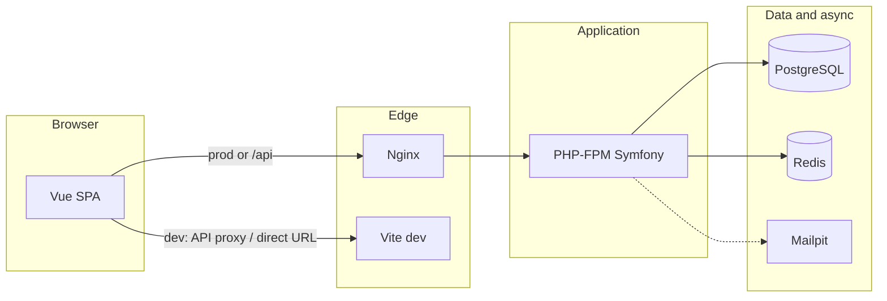

# Symfony Logistics CRM

Full-stack logistics CRM: **Symfony 6.4 LTS** (REST API and parcel workflow) and **Vue 3 + Vuetify 3** (courier panel, Leaflet map). **npm workspaces** monorepo, orchestrated with **Docker Compose**.

Repository: [github.com/gmaxsoft/symfony_logistics_crm](https://github.com/gmaxsoft/symfony_logistics_crm)

## Tech stack

| Layer | Technologies |
|-------|----------------|
| Backend | PHP 8.3, Symfony 6.4 LTS, Doctrine ORM 3, Symfony Workflow (state machine) |
| Frontend | Vue 3, Vite, Vuetify 3, Pinia, Vue Router, Axios, Leaflet |
| Database | PostgreSQL 16 |
| Queue / cache | Redis 7, Symfony Messenger |
| Web | Nginx (reverse proxy to PHP-FPM and static assets) |
| Email (dev) | Mailpit |
| Tests | PHPUnit (unit + integration), Cypress (E2E) |
| Quality (backend) | PHPStan, Psalm, PHP CS Fixer |
| Quality (frontend) | ESLint, TypeScript (`vue-tsc`) |
| CI/CD | GitHub Actions (`.github/workflows/main.yml`) |

## Architecture

The codebase is a **monorepo**: the backend and frontend are versioned together, share Docker Compose wiring and root-level tooling (Cypress, npm lockfile), but **deploy and run as separate processes** — the SPA talks to Symfony only over **HTTP (REST + JSON)**.

### Logical layers (backend)

- **HTTP / API** — Attribute-routed controllers (e.g. `ParcelController`) validate input (DTOs + Validator), return JSON, and delegate state changes to the workflow.
- **Domain** — The `Parcel` entity and `ParcelStatus` enum model the core concept; lifecycle hooks keep timestamps and identifiers consistent.
- **Workflow** — Symfony Workflow is configured as a **state machine** (`config/packages/workflow.yaml`). Allowed transitions and **guards** (Expression language) live in config; `ParcelWorkflowSubscriber` reacts to workflow events (logging, side effects such as `deliveredAt`).
- **Persistence** — Doctrine ORM maps entities to PostgreSQL; migrations live under `backend/migrations/`.
- **Async / infra** — Messenger can offload work (e.g. mail) to Redis-backed transports per `config/packages/messenger.yaml`.

### Frontend structure

- **Vue 3 + composition API** — Views under `frontend/src/views/`, reusable pieces under `frontend/src/components/`.
- **State** — Pinia store (`parcelStore`) coordinates list/detail data and workflow transitions from the API.
- **API client** — Axios instance and typed DTOs under `frontend/src/api/` and `frontend/src/types/`.
- **Routing** — Vue Router; the courier dashboard consumes `/api/parcels/...` endpoints (including `GET .../transitions` for dynamic action buttons).

### Runtime topology (Docker)

Nginx terminates HTTP and forwards PHP to **PHP-FPM**; the **Vite** container is used for local HMR. PostgreSQL holds application data; Redis backs Messenger; Mailpit captures outbound mail in development.



In **development**, the UI often runs on port **5173** and calls the API on **8080** (see `VITE_API_BASE_URL` and CORS). In **production**, Nginx can serve the built SPA from `frontend/dist` while still proxying `/api` to Symfony.

### Design choices (short)

- **Workflow in Symfony**, not in the client — the browser asks which transitions are allowed; the server remains the source of truth for parcel state.
- **Thin controllers** — orchestration and serialization in the controller layer; heavy rules in workflow config + subscribers.
- **Tests at three levels** — PHPUnit unit tests (entities/enums), integration tests (`WebTestCase` + real HTTP kernel), Cypress against running backend + Vite.

## Prerequisites

- Docker Desktop with Compose v2 (recommended for the full stack)
- **Node.js 20+** and npm 10+ — frontend from the host or `docker compose exec frontend`
- Optional: PHP 8.3 + Composer — backend without Docker

## Quick start (Docker)

```bash
git clone https://github.com/gmaxsoft/symfony_logistics_crm.git
cd symfony_logistics_crm

cp .env.example .env

docker compose up -d

# Backend: dependencies and migrations
docker compose exec php composer install
docker compose exec php bin/console doctrine:migrations:migrate --no-interaction

# Frontend (workspace; lock file lives in the repository root)
npm ci

# URLs
# Vite dev server:  http://localhost:5173
# API via Nginx:    http://localhost:8080/api
# Mailpit:          http://localhost:8025
```

See `.env.example` for ports, `DATABASE_URL`, JWT, `VITE_API_BASE_URL`, and other variables.

## Monorepo layout

```
symfony_logistics_crm/
├── backend/                 # Symfony (src/, config/, migrations/, tests/)
├── frontend/                # Vue 3 + Vite (npm workspace)
├── docker/                  # Nginx and related assets
├── cypress/                 # E2E tests
├── .github/workflows/       # CI/CD
├── package.json             # workspaces: ["frontend"], root scripts + Cypress
├── package-lock.json        # Single lockfile for the whole npm tree
├── docker-compose.yml
└── .env / .env.example
```

## Services and ports

| Service | URL |
|---------|-----|
| Nginx (API + optional frontend build) | http://localhost:8080 |
| Vite (dev) | http://localhost:5173 |
| PostgreSQL | localhost:5432 |
| Redis | localhost:6379 |
| Mailpit (UI) | http://localhost:8025 |

See `docker-compose.yml` for extra services (e.g. Messenger worker).

## Parcel workflow (API)

Places: `draft` → `picked_up` → `in_sorting_center` → `out_for_delivery` → `delivered`, with a `failed` terminal state.

Transitions include: `pick_up`, `sort`, `deliver_start`, `confirm_delivery`, `mark_failed`. Workflow guards use the Expression language component (`symfony/expression-language`).

Main REST base path: `/api/parcels` (list, create, detail, available transitions, `PATCH` to apply a transition).

## Development commands

### Backend (inside `php` container, workdir `/var/www/html`)

```bash
docker compose exec php bin/console doctrine:migrations:diff
docker compose exec php bin/console doctrine:migrations:migrate
docker compose exec php bin/console cache:warmup --env=dev

# Tests and quality
docker compose exec php vendor/bin/phpunit
docker compose exec php composer test
docker compose exec php composer phpstan
docker compose exec php composer psalm
docker compose exec php composer cs-check   # PHP CS Fixer (dry run)
docker compose exec php composer cs-fix     # apply code style fixes
```

Integration tests need a database matching `backend/.env.test` (in Docker the host is usually `database`). PHPUnit bootstraps via `tests/bootstrap.php` (Dotenv / `.env` loading).

### Frontend

From the repository root (workspaces):

```bash
npm run dev          # Vite — frontend workspace
npm run build
npm run lint         # ESLint with --fix
```

From `frontend/`:

```bash
npm run lint:check   # ESLint, no write
npm run type-check   # vue-tsc --noEmit
```

### E2E (Cypress)

From the repository root (after `npm ci`):

```bash
npm run test:e2e       # headless
npm run test:e2e:open  # interactive
```

## CI/CD (GitHub Actions)

The `main.yml` workflow roughly:

- **Backend:** Composer (with `--no-scripts` in CI), PostgreSQL service, migrations, cache warmup for PHPStan, PHP CS Fixer, PHPStan, Psalm (some steps may use `continue-on-error`), PHPUnit with coverage.
- **Frontend:** `npm ci` from the **root** (monorepo), ESLint, type-check, production build.
- **Docker:** image build smoke test (selected branches).
- **E2E:** backend + frontend dev servers, then Cypress.

## License

Proprietary (see backend `composer.json`).
